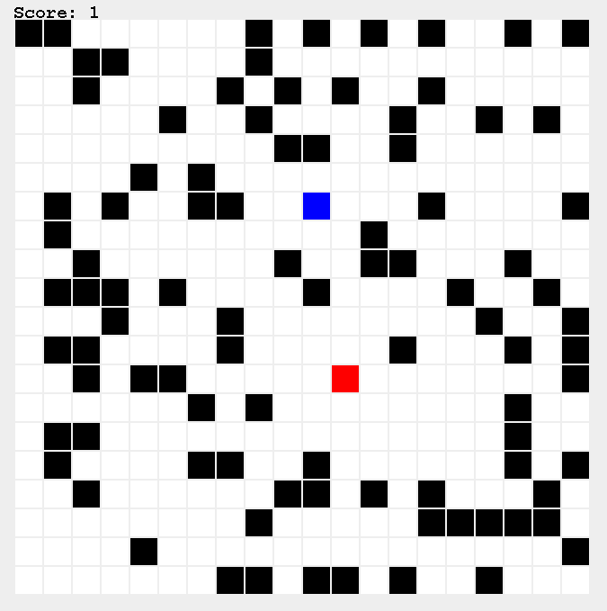
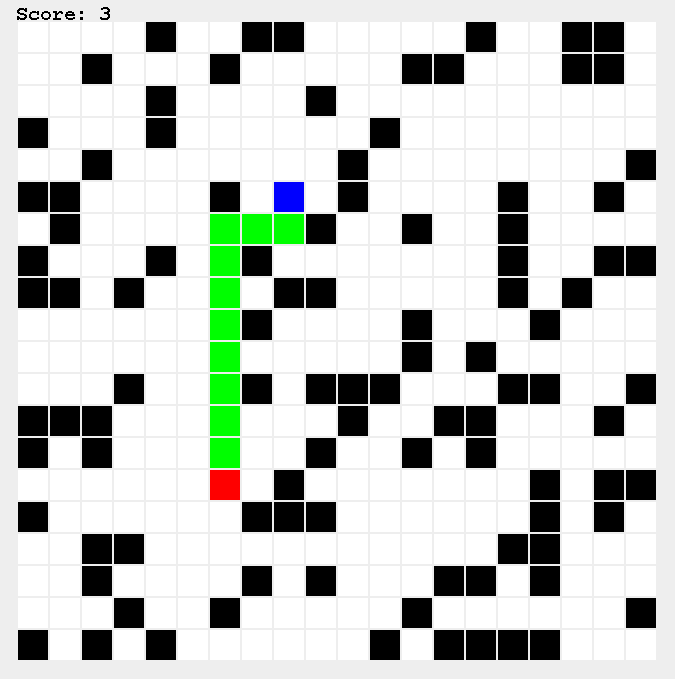

# Lab6 - Labyrinth
In this lab you will be extending an existing game where a player (blue) is being chased by a monster (red). The aim of the game is to survive as long as possible by running away from the monster.

At the moment the monster is not very threatening. It very often gets stuck behind walls and is easy to outrun.



The method `moveMonster` is very simple at the moment:
```java
public void moveMonster() {
        CellPosition playerPos = player.getPos();
        CellPosition monsterPos = monster.getPos();
        GridDirection dir = monsterPos.getDirectionTowards(playerPos); // Direction the monster will move

        if (moveBoardItem(dir, monster))
            monster = monster.shiftedBy(dir);

        // If monster and player is at same position, game is over
        if (monster.getPos().equals(player.getPos()))
            gameState = GameState.GAME_OVER;
}
```
Currently it selects the direction towards the player, but disregards any obstacles such as walls.
The objective of this lab is to make the game more fun and challenging by utilizing algorithms.

### **To solve the following task you must use your algorithmic knowledge. You will not be given any instructions**.

## Task
Make the monster smarter by having it walk the shortest route towards the player.



You can test your solution by running the tests or change the labyrinth board in `LabyrinthMain.java`.

### You have passed the lab when the all tests pass (especially `MonsterShortestPath.java`)  and you have delivered on Codegrade with green checkmark ✅
